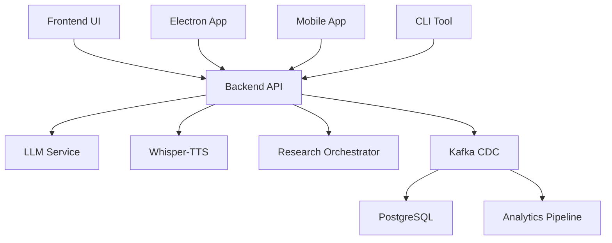

# 🏗️ **UNHINGED MONOREPO STRUCTURE**

## 📁 **Current Directory Structure**

```
Unhinged/                           # Root monorepo directory
├── 📋 README.md                    # Main project documentation
├── 📋 DEVELOPMENT.md               # Development setup guide
├── 📋 MONOREPO_STRUCTURE.md        # This file - structure documentation
├── 🔧 .gitignore                   # Comprehensive gitignore
├── 🐳 docker-compose.yml           # Main docker compose
├── 🐳 docker-compose.dev.yml       # Development environment
├── 🐳 docker-compose.staging.yml   # Staging environment
├── 🐳 docker-compose.prod.yml      # Production environment
├── 🧪 test-full-system.sh          # System integration tests
├── 🧪 test-live-system.js          # Live system tests
│
├── 🎯 services/                    # Core microservices
│   ├── backend/                    # Kotlin/Spring Boot API
│   ├── frontend/                   # React/TypeScript UI
│   ├── whisper-tts/               # Python voice processing
│   ├── llm/                       # LLM inference service
│   └── research-orchestrator/     # Python research automation
│
├── 🗄️ infrastructure/              # Infrastructure & data
│   ├── database/                  # PostgreSQL configurations
│   ├── kafka/                     # Kafka CDC system
│   ├── storage/                   # Database migrations & schemas
│   └── monitoring/                # Prometheus, Grafana configs
│
├── 🧩 packages/                   # Shared libraries & utilities
│   ├── core/                      # Core business logic
│   ├── schema/                    # Shared schemas & types
│   ├── adapters/                  # Service adapters
│   ├── integrations/              # External integrations
│   └── tools/                     # Development tools
│
├── 🎨 applications/               # End-user applications
│   ├── electron/                  # Desktop application
│   ├── mobile/                    # React Native mobile app
│   └── cli/                       # Command-line interface
│
├── 🧪 testing/                    # Cross-service testing
│   ├── e2e/                       # End-to-end tests
│   ├── integration/               # Integration tests
│   ├── performance/               # Load & performance tests
│   └── fixtures/                  # Test data & fixtures
│
├── 📚 docs/                       # Documentation
│   ├── api/                       # API documentation
│   ├── architecture/              # System architecture
│   ├── deployment/                # Deployment guides
│   └── user/                      # User documentation
│
├── 🚀 scripts/                    # Automation scripts
│   ├── dev.sh                     # Development startup
│   ├── staging.sh                 # Staging deployment
│   ├── prod.sh                    # Production deployment
│   ├── migrate.sh                 # Database migrations
│   └── test.sh                    # Test runner
│
└── 🔧 config/                     # Configuration files
    ├── environments/              # Environment-specific configs
    ├── secrets/                   # Secret management
    └── templates/                 # Configuration templates
```

## 🎯 **Service Architecture**

### **Core Services**
- **backend**: Kotlin/Spring Boot API gateway and business logic
- **frontend**: React/TypeScript universal UI system
- **whisper-tts**: Python voice processing (STT/TTS)
- **llm**: LLM inference and prompt management
- **research-orchestrator**: Automated research and data gathering

### **Infrastructure**
- **database**: PostgreSQL with CDC capabilities
- **kafka**: Event streaming and CDC pipeline
- **storage**: Database migrations and schema management
- **monitoring**: Observability and metrics

### **Shared Packages**
- **core**: Business logic and domain models
- **schema**: Shared TypeScript/JSON schemas
- **adapters**: Service communication adapters
- **integrations**: External API integrations
- **tools**: Development and build tools

## 🔄 **Data Flow Architecture**



## 🧪 **Testing Strategy**

### **Unit Tests**
- Each service has its own unit tests
- Shared packages have comprehensive test suites
- Coverage thresholds enforced per service

### **Integration Tests**
- Cross-service communication testing
- Database integration testing
- Kafka event flow testing

### **E2E Tests**
- Full user workflow testing
- Voice-to-UI generation testing
- Multi-service orchestration testing

### **Performance Tests**
- Load testing for each service
- CDC pipeline performance testing
- Audio processing benchmarks

## 🚀 **Development Workflow**

### **Local Development**
```bash
# Start all services
./scripts/dev.sh

# Run tests
./scripts/test.sh

# Database migrations
./scripts/migrate.sh
```

### **Service-Specific Development**
```bash
# Frontend only
cd services/frontend && npm run dev

# Backend only
cd services/backend && ./gradlew bootRun

# Voice processing only
cd services/whisper-tts && python app.py
```

## 📦 **Package Management**

### **Node.js Services**
- **Root**: Workspace configuration
- **Frontend**: React/TypeScript dependencies
- **Shared packages**: Common utilities

### **Python Services**
- **whisper-tts**: Voice processing dependencies
- **research-orchestrator**: Research automation dependencies

### **Java/Kotlin Services**
- **backend**: Spring Boot and Kotlin dependencies

## 🔧 **Configuration Management**

### **Environment Variables**
- Development: `.env.development`
- Staging: `.env.staging`
- Production: `.env.production`

### **Service Configuration**
- Each service has its own config directory
- Shared configurations in `/config`
- Secrets managed separately

## 📊 **Monitoring & Observability**

### **Metrics**
- Prometheus metrics collection
- Grafana dashboards
- Custom business metrics

### **Logging**
- Structured logging across all services
- Centralized log aggregation
- Log correlation with trace IDs

### **Tracing**
- Distributed tracing with correlation IDs
- Request flow visualization
- Performance bottleneck identification

## 🔐 **Security**

### **Secrets Management**
- Environment-specific secret files
- No secrets in version control
- Secure secret injection in containers

### **API Security**
- JWT authentication
- Rate limiting
- CORS configuration

### **Data Security**
- Encrypted data at rest
- Secure communication between services
- Audit logging for sensitive operations

## 🚀 **Deployment**

### **Development**
- Docker Compose for local development
- Hot reloading for rapid iteration
- Integrated testing environment

### **Staging**
- Kubernetes deployment
- Production-like environment
- Automated testing pipeline

### **Production**
- Kubernetes with high availability
- Blue-green deployments
- Comprehensive monitoring

## 📈 **Scaling Strategy**

### **Horizontal Scaling**
- Stateless service design
- Load balancing
- Auto-scaling based on metrics

### **Data Scaling**
- Database read replicas
- Kafka partitioning
- Caching strategies

### **Performance Optimization**
- Service-specific optimizations
- Database query optimization
- CDN for static assets

---

## 🎯 **Next Steps for Cleanup**

1. **Reorganize directories** according to this structure
2. **Consolidate scattered files** into proper locations
3. **Update documentation** to reflect new structure
4. **Fix import paths** and references
5. **Update CI/CD pipelines** for new structure
6. **Create workspace configurations** for package management
