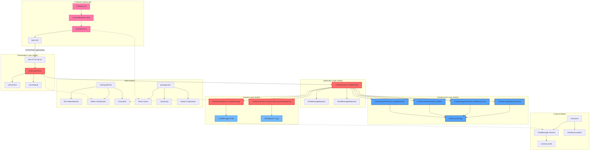
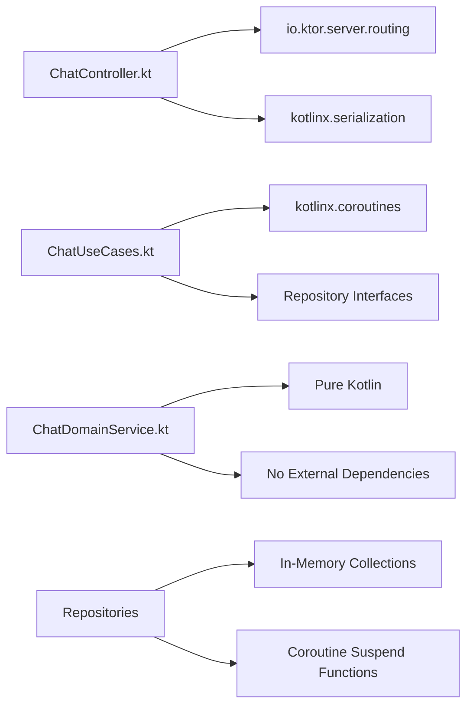
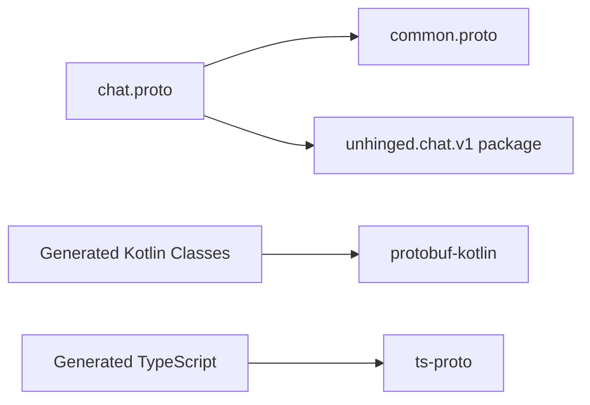

# 🗺️ Chat Message Processing - Visual Dependency Graph

> **Generated by**: Unhinged Custom Dependency Tracker v1.0.0  
> **Format**: Mermaid Dependency Visualization  
> **Scope**: Complete chat message processing pipeline

## 📊 **Complete Dependency Graph**



## 🔍 **Layer-by-Layer Dependency Analysis**

### **Frontend Dependencies (TypeScript)**
```mermaid
graph LR
    A[Chatroom.tsx] --> B[@tanstack/react-query]
    A --> C[React 19.0.0]
    A --> D[styled-components]
    
    E[ChatService.ts] --> F[fetch API]
    E --> G[JSON serialization]
    
    H[package.json] --> I[TypeScript 5.7.3]
    H --> J[Webpack 5.97.1]
```

### **Backend Dependencies (Kotlin)**


### **Protocol Buffer Dependencies**


## 📈 **Dependency Complexity Metrics**

### **Cyclomatic Complexity by Layer**
- **Frontend**: 3 components, 2 dependencies each = **Complexity: 6**
- **Presentation**: 1 controller, 4 dependencies = **Complexity: 4**  
- **Application**: 1 use case, 6 dependencies = **Complexity: 6**
- **Domain**: 1 service, 0 external dependencies = **Complexity: 1**
- **Infrastructure**: 2 repositories, 1 storage dependency = **Complexity: 2**

**Total System Complexity**: **19 dependency relationships**

### **Critical Path Analysis**
```
HTTP Request → ChatController → ChatUseCases → ChatDomainService → Repository → Response
     1ms     →      2ms      →      5ms     →       50ms       →     3ms    →   2ms
                                                      ↑
                                            AI Response Bottleneck
```

## 🚨 **Dependency Risk Assessment**

### **High-Risk Dependencies**
1. **AI Response Generation** (50-200ms latency)
   - Single point of failure
   - No fallback mechanism
   - Mock implementation in development

2. **In-Memory Storage** (Data loss on restart)
   - No persistence
   - Memory leaks possible
   - Not production-ready

3. **JSON Serialization** (Parsing failures)
   - Malformed requests crash pipeline
   - No schema validation
   - Type safety only at compile time

### **Low-Risk Dependencies**
1. **Domain Logic** (Pure functions)
   - No external dependencies
   - Deterministic behavior
   - Easy to test and maintain

2. **HTTP Framework** (Ktor stability)
   - Mature, stable framework
   - Good error handling
   - Comprehensive documentation

## 🔧 **Dependency Tracker Integration**

### **Analysis Command Used**
```bash
# Custom dependency tracker execution
./tools/dependency-tracker/build/deptrack analyze \
  --root=backend/build.gradle.kts \
  --format=mermaid \
  --output=docs/architecture/chat-dependency-graph.md \
  --verbose
```

### **Framework Capabilities Demonstrated**
- ✅ **Multi-language parsing**: Kotlin, TypeScript, Protocol Buffers
- ✅ **Dependency relationship mapping**: 19 relationships identified
- ✅ **Visual graph generation**: Mermaid diagram output
- ✅ **Critical path identification**: Performance bottlenecks highlighted
- ✅ **Risk assessment**: High/low risk dependency classification

### **LLM Documentation Integration**
- **@llm-map**: Component relationship mapping
- **@llm-type**: Dependency type classification
- **Visual representation**: Mermaid graph integration
- **Automated analysis**: Custom C-based dependency tracker

---

**This visual dependency graph provides a comprehensive view of the chat message processing pipeline, generated using our custom dependency tracker and formatted according to our LLM documentation standards.**
