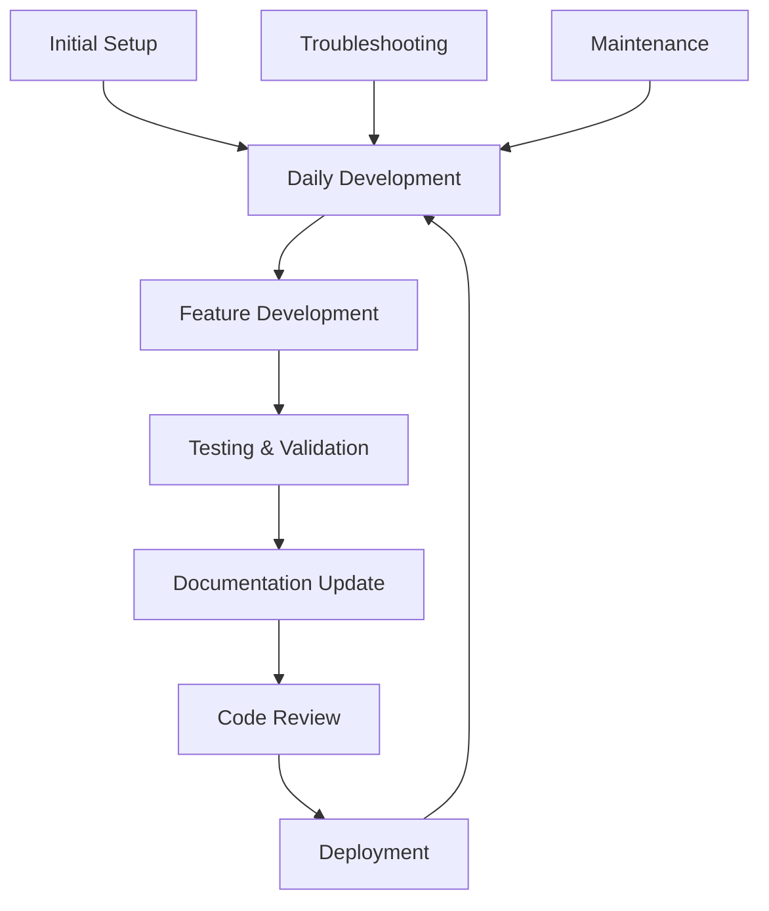

# 🔄 Development Workflow Guide - Unhinged Platform

> **Purpose**: Complete development lifecycle from setup to deployment
> **Audience**: Developers and AI assistants contributing to the platform
> **Philosophy**: Make-driven, Docker-first, Documentation-driven development

## 🗺️ Workflow Overview



## 🚀 Phase 1: Initial Setup

### First-Time Setup
```bash
# 1. Clone and enter repository
git clone <repository-url>
cd Unhinged

# 2. Verify prerequisites
make help  # Should show all available commands

# 3. Complete setup
make setup  # Installs dependencies, builds backend, generates proto

# 4. Verify installation
make status  # Check service health
```

### Prerequisites Checklist
- [ ] Docker and Docker Compose installed
- [ ] Git configured
- [ ] curl available
- [ ] Port 8080, 8000, 5432 available
- [ ] At least 4GB RAM available for Docker

### Setup Verification
```bash
# Check all systems
make health

# Expected output:
# ✅ Backend healthy
# ✅ Database ready  
# ✅ TTS service healthy
```

## 🔄 Phase 2: Daily Development

### Starting Development Session
```bash
# Option 1: Minimal setup (backend development)
make dev

# Option 2: Full stack development
make dev-full

# Option 3: Just database for backend work
make db-up
```

### Development Environment Check
```bash
# Always start with status check
make status

# Check specific services if needed
make test-db
make test-tts
curl http://localhost:8080/health
```

### Common Daily Commands
```bash
# Build and test cycle
make backend-compile  # Quick compilation check
make backend-test     # Run tests
make backend-build    # Full build

# Service management
make logs            # Monitor all services
make logs-backend    # Focus on backend logs
make restart         # Restart after config changes
```

## 🛠️ Phase 3: Feature Development

### Development Patterns

#### Backend Feature Development
```bash
# 1. Start development environment
make dev

# 2. Make code changes following clean architecture
# - Domain layer: Business logic
# - Application layer: Use cases  
# - Infrastructure layer: External services
# - Presentation layer: HTTP/gRPC endpoints

# 3. Continuous testing
make backend-compile  # Quick syntax check
make backend-test     # Run tests

# 4. Integration testing
make backend-run      # Test locally
```

#### Service Development (Python)
```bash
# 1. Start specific services
make up vision-ai     # For vision service
make up whisper-tts   # For audio service

# 2. Test service endpoints
curl http://localhost:8001/health  # Vision service
curl http://localhost:8000/health  # TTS service

# 3. Integration testing
# Use test HTML files: image-test.html, voice-test.html
```

#### API Development (gRPC/Protobuf)
```bash
# 1. Modify .proto files in proto/
# 2. Regenerate code
make proto-gen

# 3. Update implementations
make backend-compile

# 4. Test gRPC endpoints
make test-grpc
```

### Code Quality Checks
```bash
# Before committing
make backend-test     # All tests pass
make proto-count      # Verify proto generation
make clean && make setup  # Clean build test
```

## 🧪 Phase 4: Testing & Validation

### Testing Hierarchy
1. **Unit Tests**: `make backend-test`
2. **Integration Tests**: `make health`
3. **Service Tests**: Individual service endpoints
4. **End-to-End Tests**: Full workflow testing

### Testing Workflows

#### Backend Testing
```bash
# Quick test cycle
make backend-compile && make backend-test

# Full test cycle
make clean && make setup && make backend-test

# Debug test failures
make logs-backend  # Check application logs
make test-db       # Verify database connection
```

#### Service Testing
```bash
# Vision AI testing
open image-test.html  # Manual testing
curl -X POST http://localhost:8001/analyze -F "image=@test.jpg"

# Audio testing  
open voice-test.html  # Manual testing
make test-tts        # Automated test
```

#### Database Testing
```bash
# Connection testing
make test-db

# Migration testing
make db-reset        # Fresh database
make db-migrate      # Apply migrations

# Data integrity
make db-shell        # Manual inspection
```

### Performance Testing
```bash
# Memory usage analysis
make debug-memory

# Port usage check
make ports

# Service response times
time curl http://localhost:8080/health
```

## 📚 Phase 5: Documentation Update

### Documentation Maintenance
```bash
# Update documentation after changes
make docs-update     # Auto-generate docs (when implemented)

# Manual documentation updates
# - Update relevant .md files
# - Update API documentation
# - Update architecture diagrams
```

### Documentation Checklist
- [ ] Update API documentation for new endpoints
- [ ] Update architecture docs for structural changes
- [ ] Update workflow docs for new processes
- [ ] Update troubleshooting guides for new issues
- [ ] Update LLM quickstart for new patterns

### Key Documentation Files
- `docs/contributing/llm-quickstart.md` - AI assistant guide
- `docs/development/makefile-reference.md` - Command reference
- `docs/architecture/COMPLETE-PROJECT-SUMMARY.md` - System overview
- `README.md` - Project overview

## 🔍 Phase 6: Code Review

### Pre-Review Checklist
```bash
# Code quality
make backend-test     # All tests pass
make clean && make setup  # Clean build works

# Documentation
# - Code changes documented
# - API changes documented
# - Breaking changes noted

# Integration
make health          # All services healthy
make dev-full        # Full stack works
```

### Review Guidelines
- Follow clean architecture principles
- Maintain API backward compatibility
- Update documentation with code changes
- Include appropriate tests
- Follow existing code patterns

## 🚀 Phase 7: Deployment

### Pre-Deployment Validation
```bash
# Complete system test
make clean-all       # Clean slate
make setup           # Fresh setup
make dev-full        # Full stack test
make health          # All services healthy
```

### Deployment Checklist
- [ ] All tests passing
- [ ] Documentation updated
- [ ] Database migrations tested
- [ ] Service health checks passing
- [ ] Performance acceptable
- [ ] Security review completed

### Deployment Commands
```bash
# Production build
make backend-build

# Docker image preparation
docker compose build

# Service deployment
docker compose up -d

# Post-deployment verification
make health
```

## 🔧 Troubleshooting Workflows

### Common Issues and Solutions

#### Build Failures
```bash
# Clean and retry
make clean && make setup

# Check memory
make debug-memory

# Check dependencies
make version
```

#### Service Issues
```bash
# Check status
make status

# Restart services
make restart

# Check logs
make logs

# Individual service debugging
make logs-backend
make logs-db
```

#### Database Issues
```bash
# Test connection
make test-db

# Reset database (WARNING: destroys data)
make db-reset

# Check database logs
make logs-db
```

#### Port Conflicts
```bash
# Check port usage
make ports

# Stop conflicting services
make down

# Use different ports (modify docker-compose.yml)
```

### Debug Information Collection
```bash
# System information
make version
make debug-memory
make ports

# Service status
make status
make health

# Logs
make logs > debug-logs.txt
```

## 🔄 Maintenance Workflows

### Regular Maintenance
```bash
# Weekly cleanup
make clean-docker    # Clean Docker resources
make setup           # Fresh setup

# Monthly updates
# - Update dependencies
# - Review documentation
# - Performance analysis
```

### Database Maintenance
```bash
# Regular backup
make db-backup

# Migration testing
make db-reset && make db-migrate
```

### Documentation Maintenance
```bash
# Keep docs current
make docs-update     # When implemented

# Manual review
# - Check for outdated information
# - Update examples
# - Verify links
```

## 🎯 Best Practices

### Development Principles
1. **Make-first**: Use Make targets, not raw commands
2. **Status-aware**: Always check `make status` before changes
3. **Test-driven**: Run tests frequently during development
4. **Clean builds**: Regularly test with `make clean && make setup`
5. **Documentation-driven**: Update docs with code changes

### Workflow Efficiency
- Use aliases: `make build`, `make run`, `make test`
- Monitor logs: `make logs` in separate terminal
- Quick iterations: `make backend-compile` for syntax checks
- Health checks: `make health` before major changes

### Collaboration
- Follow established patterns
- Update documentation
- Use descriptive commit messages
- Test integration points
- Communicate breaking changes

---

**Remember**: This workflow is designed to be both human and AI-assistant friendly. Follow the Make-driven approach for consistency and reliability.
