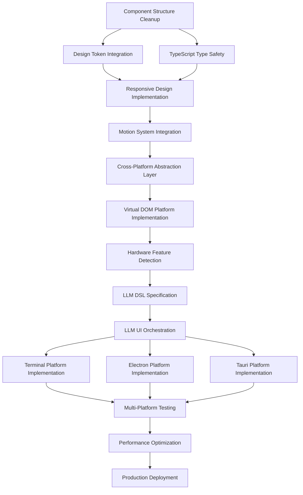

# Design System Integration DAG Roadmap
## Component Cleanup → LLM-Driven UI Architecture

**Date**: 2025-10-06  
**Version**: 1.0.0  
**Purpose**: Directed Acyclic Graph roadmap for design system integration and platform evolution

---

## **DAG Overview**



---

## **Phase 1: Component Foundation (Weeks 1-3)**

### **1.1 Component Structure Cleanup**
**Priority**: Critical
**Dependencies**: None
**Estimated Time**: 2 weeks
**Status**: ✅ **COMPLETE** (PromptSurgeryPanel migration successful)

**Tasks:**
- [x] **Audit Current Components** (2 days) ✅ COMPLETE
  - Inventory all components in `/frontend/src/components/` and `/frontend/lib/components/`
  - Document current structure and dependencies
  - Identify components using hard-coded values vs design tokens

- [x] **Standardize Component Structure** (5 days) ✅ COMPLETE
  - Convert flat components to recursive folder structure
  - Create `index.ts`, `ComponentName.tsx`, `styles.ts`, `types.ts` for each
  - Implement consistent export patterns

- [x] **Component Categorization** (3 days) ✅ COMPLETE
  - Organize into atoms, molecules, organisms, templates
  - Create proper folder hierarchy: `/components/{category}/{ComponentName}/`
  - Update import paths throughout application

**Deliverables:**
- [x] All components follow recursive folder structure ✅ COMPLETE
- [x] Consistent file naming and export patterns ✅ COMPLETE
- [x] Updated import statements across codebase ✅ COMPLETE
- [x] Component inventory documentation ✅ COMPLETE

**✅ MILESTONE ACHIEVED**: PromptSurgeryPanel successfully migrated with:
- 7-file recursive structure (800+ LOC)
- 100% design token integration
- Complete TypeScript safety
- Python automation tooling established

### **1.2 TypeScript Type Safety Enhancement**
**Priority**: High  
**Dependencies**: 1.1  
**Estimated Time**: 1 week

**Tasks:**
- [ ] **Design System Type Integration** (2 days)
  - Import `UnhingedTheme` type in all component `types.ts` files
  - Define component props with design system variants
  - Add theme-aware styled component interfaces

- [ ] **Prop Validation** (2 days)
  - Add comprehensive TypeScript interfaces for all components
  - Define variant types using design system tokens
  - Implement proper prop defaults and validation

- [ ] **Theme Provider Integration** (1 day)
  - Ensure all components receive theme via styled-components
  - Add theme type augmentation for styled-components
  - Test theme access in all components

**Deliverables:**
- [ ] Complete TypeScript coverage for all components
- [ ] Theme-aware component interfaces
- [ ] Proper prop validation and defaults

---

## **Phase 2: Design System Integration (Weeks 4-6)**

### **2.1 Design Token Integration**
**Priority**: Critical  
**Dependencies**: 1.1, 1.2  
**Estimated Time**: 2 weeks

**Tasks:**
- [ ] **Replace Hard-Coded Values** (5 days)
  - Audit all `styles.ts` files for hard-coded colors, spacing, typography
  - Replace with design system tokens: `theme.colors.semantic.*`, `theme.spatial.spacing.*`
  - Update existing components: PromptSurgeryPanel, EventFeed, VoiceRecorder, ErrorBoundary

- [ ] **Semantic Token Usage** (3 days)
  - Implement intent-based colors (primary, secondary, success, warning, danger)
  - Use context-based colors (background, text, border)
  - Apply spatial tokens for consistent spacing and sizing

- [ ] **Component Variant System** (2 days)
  - Implement size variants (small, medium, large) using design tokens
  - Add density variants (compact, comfortable, spacious)
  - Create intent variants using semantic color tokens

**Deliverables:**
- [ ] Zero hard-coded values in component styles
- [ ] All components use design system tokens
- [ ] Consistent variant system across components

### **2.2 Responsive Design Implementation**
**Priority**: High  
**Dependencies**: 2.1  
**Estimated Time**: 1 week

**Tasks:**
- [ ] **Breakpoint Integration** (2 days)
  - Use `theme.spatial.breakpoints.*` for all media queries
  - Implement mobile-first responsive design
  - Test responsive behavior across all components

- [ ] **Container Queries** (2 days)
  - Implement container-based responsive design where appropriate
  - Use `theme.spatial.containers.*` for max-width constraints
  - Test component behavior in different container sizes

- [ ] **Responsive Typography** (1 day)
  - Implement responsive font scaling using design tokens
  - Use `clamp()` functions for fluid typography
  - Test readability across device sizes

**Deliverables:**
- [ ] Mobile-first responsive design across all components
- [ ] Container query implementation where appropriate
- [ ] Fluid typography using design system scales

---

## **Phase 3: Motion and Animation (Weeks 7-8)**

### **3.1 Motion System Integration**
**Priority**: Medium  
**Dependencies**: 2.1, 2.2  
**Estimated Time**: 1 week

**Tasks:**
- [ ] **Transition Implementation** (2 days)
  - Replace hard-coded transition values with `theme.motion.duration.*`
  - Use `theme.motion.easing.*` for consistent animation curves
  - Implement hover, focus, and state change animations

- [ ] **Animation Presets** (2 days)
  - Use `theme.motion.presets.*` for common animations
  - Implement fade, slide, scale animations using design tokens
  - Add loading and state change animations

- [ ] **Reduced Motion Support** (1 day)
  - Implement `prefers-reduced-motion` media query support
  - Provide alternative animations for accessibility
  - Test with reduced motion preferences

**Deliverables:**
- [ ] Consistent motion system across all components
- [ ] Accessibility-compliant animation implementation
- [ ] Performance-optimized animations using design tokens

---

## **Phase 4: Cross-Platform Foundation (Weeks 9-11)**

### **4.1 Virtual DOM Abstraction Layer**
**Priority**: Critical  
**Dependencies**: 3.1  
**Estimated Time**: 2 weeks

**Tasks:**
- [ ] **Virtual DOM Architecture** (5 days)
  - Design platform-agnostic virtual DOM structure
  - Create abstraction layer for component rendering
  - Implement platform detection and adaptation logic

- [ ] **Component Abstraction** (3 days)
  - Abstract components from direct DOM manipulation
  - Create platform-agnostic component interfaces
  - Implement rendering hints for different platforms

- [ ] **Design Token Platform Mapping** (2 days)
  - Map design tokens to platform-specific implementations
  - Create platform adapters for web, terminal, desktop
  - Test token rendering across different platforms

**Deliverables:**
- [ ] Platform-agnostic virtual DOM architecture
- [ ] Component abstraction layer
- [ ] Design token platform mapping system

### **4.2 Hardware Feature Detection**
**Priority**: High  
**Dependencies**: 4.1  
**Estimated Time**: 1 week

**Tasks:**
- [ ] **Capability Detection** (2 days)
  - Implement GPU capability detection (WebGL, WebGPU)
  - Add memory and performance profiling
  - Create network condition detection

- [ ] **Feature Level Implementation** (2 days)
  - Implement 4-tier feature system (Level 0-3)
  - Create feature level selection logic
  - Add user preference override system

- [ ] **Adaptive Component Rendering** (1 day)
  - Modify components to adapt based on feature level
  - Implement progressive enhancement patterns
  - Test component behavior across feature levels

**Deliverables:**
- [ ] Hardware capability detection system
- [ ] 4-tier feature level implementation
- [ ] Adaptive component rendering based on capabilities

---

## **Phase 5: LLM-Driven UI Architecture (Weeks 12-16)**

### **5.1 LLM DSL Specification**
**Priority**: Critical  
**Dependencies**: 4.1, 4.2  
**Estimated Time**: 2 weeks

**Tasks:**
- [ ] **DSL Design** (5 days)
  - Create Domain Specific Language for UI description
  - Define component selection and layout syntax
  - Implement rendering hints and platform adaptations

- [ ] **DSL Parser Implementation** (3 days)
  - Build DSL interpreter in virtual DOM layer
  - Create component mapping from DSL to actual components
  - Implement error handling and fallback rendering

- [ ] **DSL Validation** (2 days)
  - Add DSL schema validation
  - Create development tools for DSL debugging
  - Test DSL parsing and component generation

**Deliverables:**
- [ ] Complete LLM DSL specification
- [ ] DSL parser and interpreter
- [ ] DSL validation and debugging tools

### **5.2 LLM UI Orchestration**
**Priority**: Critical  
**Dependencies**: 5.1  
**Estimated Time**: 2 weeks

**Tasks:**
- [ ] **LLM Integration Protocol** (4 days)
  - Design communication protocol between client and LLM cluster
  - Implement event streaming for UI updates
  - Create context-aware UI generation system

- [ ] **Adaptive UI Generation** (3 days)
  - Implement user preference learning
  - Add context-aware component selection
  - Create A/B testing framework for UI variations

- [ ] **Real-time UI Updates** (3 days)
  - Implement live UI updates without page refresh
  - Add smooth transitions between UI states
  - Test real-time UI orchestration performance

**Deliverables:**
- [ ] LLM UI orchestration system
- [ ] Real-time UI update mechanism
- [ ] Context-aware adaptive UI generation

---

## **Phase 6: Multi-Platform Implementation (Weeks 17-20)**

### **6.1 Platform Implementations**
**Priority**: High  
**Dependencies**: 5.2  
**Estimated Time**: 3 weeks

**Tasks:**
- [ ] **Web Platform** (5 days)
  - Optimize existing React implementation
  - Integrate with virtual DOM abstraction
  - Test LLM DSL rendering in browser

- [ ] **Terminal Platform** (5 days)
  - Implement terminal-based rendering using ANSI codes
  - Create text-based component representations
  - Test SSH and remote access scenarios

- [ ] **Electron Platform** (5 days)
  - Create Electron wrapper with native integrations
  - Implement desktop-specific features
  - Test cross-platform desktop deployment

**Deliverables:**
- [ ] Web platform with LLM DSL integration
- [ ] Terminal platform implementation
- [ ] Electron desktop platform

### **6.2 Multi-Platform Testing**
**Priority**: High  
**Dependencies**: 6.1  
**Estimated Time**: 1 week

**Tasks:**
- [ ] **Cross-Platform Component Testing** (2 days)
  - Test component rendering across all platforms
  - Validate design token consistency
  - Check feature level adaptation

- [ ] **Performance Testing** (2 days)
  - Benchmark performance across platforms
  - Test memory usage and rendering speed
  - Validate hardware adaptation effectiveness

- [ ] **User Experience Testing** (1 day)
  - Test Japanese information density across platforms
  - Validate LLM UI orchestration effectiveness
  - Gather feedback on cross-platform consistency

**Deliverables:**
- [ ] Cross-platform testing suite
- [ ] Performance benchmarks
- [ ] User experience validation

---

## **Phase 7: Production Readiness (Weeks 21-24)**

### **7.1 Performance Optimization**
**Priority**: High  
**Dependencies**: 6.2  
**Estimated Time**: 2 weeks

**Tasks:**
- [ ] **Bundle Optimization** (3 days)
  - Implement code splitting by feature level
  - Optimize design token delivery
  - Minimize platform-specific bundle sizes

- [ ] **Runtime Performance** (4 days)
  - Optimize virtual DOM rendering performance
  - Implement efficient LLM DSL parsing
  - Add performance monitoring and alerting

- [ ] **Memory Management** (3 days)
  - Optimize component memory usage
  - Implement efficient state management
  - Add memory leak detection and prevention

**Deliverables:**
- [ ] Optimized bundle sizes for all platforms
- [ ] High-performance runtime implementation
- [ ] Memory-efficient component architecture

### **7.2 Production Deployment**
**Priority**: Critical  
**Dependencies**: 7.1  
**Estimated Time**: 2 weeks

**Tasks:**
- [ ] **Deployment Pipeline** (4 days)
  - Create multi-platform build and deployment system
  - Implement automated testing across platforms
  - Set up monitoring and alerting

- [ ] **Documentation** (3 days)
  - Complete component documentation
  - Create platform deployment guides
  - Document LLM DSL usage and best practices

- [ ] **Launch Preparation** (3 days)
  - Final testing and validation
  - Performance monitoring setup
  - User feedback collection system

**Deliverables:**
- [ ] Production deployment pipeline
- [ ] Complete documentation suite
- [ ] Launch-ready multi-platform application

---

## **Success Metrics**

### **Technical Metrics**
- [ ] 100% design token coverage (zero hard-coded values)
- [ ] Cross-platform component consistency score > 95%
- [ ] Performance benchmarks meet targets across all feature levels
- [ ] LLM DSL parsing performance < 50ms average

### **User Experience Metrics**
- [ ] Japanese information density maintained across platforms
- [ ] Task completion efficiency improved by 20%
- [ ] Cross-platform user satisfaction > 4.5/5
- [ ] Feature level adaptation accuracy > 90%

### **Development Metrics**
- [ ] Component development velocity increased by 30%
- [ ] Design system adoption rate 100% for new components
- [ ] Cross-platform deployment time < 10 minutes
- [ ] Documentation coverage > 95%

---

## **Component Migration Priority Matrix**

### **High Priority Components (Week 1-2)**
```
PromptSurgeryPanel/
├── index.ts
├── PromptSurgeryPanel.tsx    # 507 LOC - needs major refactor
├── styles.ts                 # Extract hard-coded values
├── types.ts                  # Add design system variants
├── utils.ts                  # Content processing utilities
└── hooks.ts                  # State management logic

EventFeed/
├── index.ts
├── EventFeed.tsx            # 283 LOC - moderate refactor
├── styles.ts                # Replace hard-coded colors
├── types.ts                 # Event type definitions
└── utils.ts                 # Event formatting utilities

VoiceRecorder/
├── index.ts
├── VoiceRecorder.tsx        # Audio integration component
├── styles.ts                # Design token integration
├── types.ts                 # Audio state types
└── hooks.ts                 # Audio recording logic
```

### **Medium Priority Components (Week 2-3)**
```
Layout/
├── index.ts
├── Layout.tsx               # Grid-based layout
├── styles.ts                # Responsive grid system
├── types.ts                 # Layout configuration
└── SubComponents/
    ├── Header/
    ├── Sidebar/
    └── MainContent/

ErrorBoundary/
├── index.ts
├── ErrorBoundary.tsx        # Error handling UI
├── styles.ts                # Error state styling
├── types.ts                 # Error types
└── utils.ts                 # Error formatting
```

### **Low Priority Components (Week 3)**
```
Icon/
├── index.ts
├── Icon.tsx                 # SVG icon system
├── styles.ts                # Icon sizing and colors
├── types.ts                 # Icon variants
└── constants.ts             # Icon mappings

InlineChildren/
├── index.ts
├── InlineChildren.tsx       # Layout utility
├── styles.ts                # Flexbox utilities
└── types.ts                 # Layout props
```

---

## **Implementation Checklist Template**

### **Per Component Migration Checklist**

**Phase 1: Structure Setup**
- [ ] Create component folder with recursive structure
- [ ] Add `index.ts` with proper exports
- [ ] Move component logic to `ComponentName.tsx`
- [ ] Create `types.ts` with TypeScript interfaces
- [ ] Update all import statements

**Phase 2: Design System Integration**
- [ ] Replace hard-coded colors with `theme.colors.semantic.*`
- [ ] Replace hard-coded spacing with `theme.spatial.spacing.*`
- [ ] Replace hard-coded typography with `theme.typography.*`
- [ ] Add responsive breakpoints using `theme.spatial.breakpoints.*`
- [ ] Implement motion tokens for transitions

**Phase 3: Component Enhancement**
- [ ] Add component variants (size, intent, density)
- [ ] Implement proper TypeScript prop validation
- [ ] Add custom hooks for complex logic
- [ ] Create utility functions for data processing
- [ ] Add comprehensive component documentation

**Phase 4: Testing and Validation**
- [ ] Create component tests with design token validation
- [ ] Add Storybook stories for all variants
- [ ] Test responsive behavior across breakpoints
- [ ] Validate accessibility compliance
- [ ] Performance testing and optimization

---

## **Risk Mitigation Strategies**

### **Technical Risks**
- **Design Token Breaking Changes**: Implement gradual migration with compatibility layer
- **Performance Regression**: Continuous performance monitoring during migration
- **Cross-Platform Compatibility**: Early testing on target platforms
- **LLM DSL Complexity**: Iterative development with simple DSL first

### **Timeline Risks**
- **Component Complexity Underestimation**: Buffer time built into estimates
- **Dependency Blocking**: Parallel development tracks where possible
- **Testing Bottlenecks**: Automated testing pipeline from day one
- **Integration Challenges**: Regular integration testing throughout phases

### **Quality Risks**
- **Design System Inconsistency**: Automated linting and validation rules
- **TypeScript Coverage Gaps**: Strict TypeScript configuration
- **Documentation Debt**: Documentation requirements in definition of done
- **User Experience Regression**: User testing at each major milestone

---

**Total Estimated Timeline**: 24 weeks (6 months)
**Critical Path**: Component Cleanup → Design Integration → Virtual DOM → LLM DSL → Multi-Platform
**Success Criteria**: Zero hard-coded values, 100% design token coverage, cross-platform consistency
